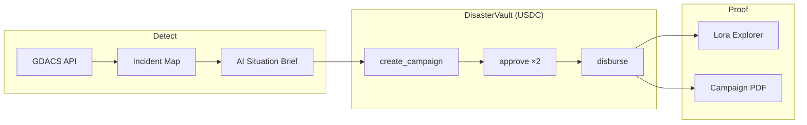
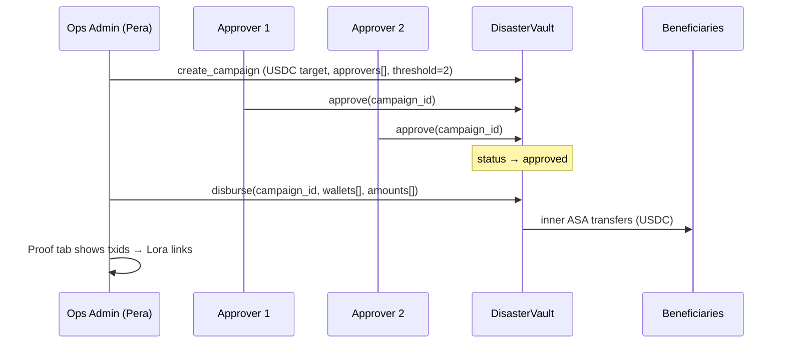
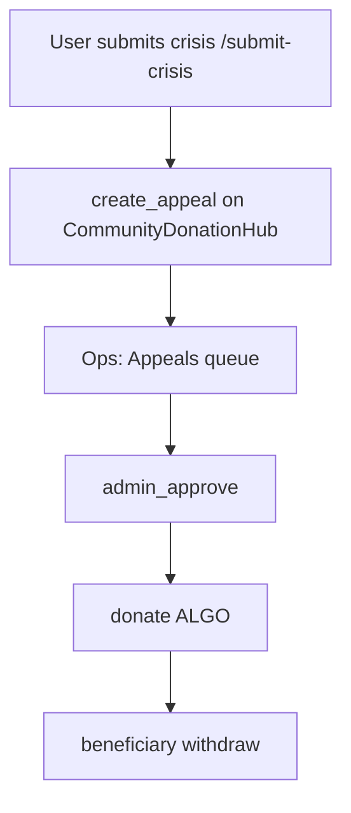
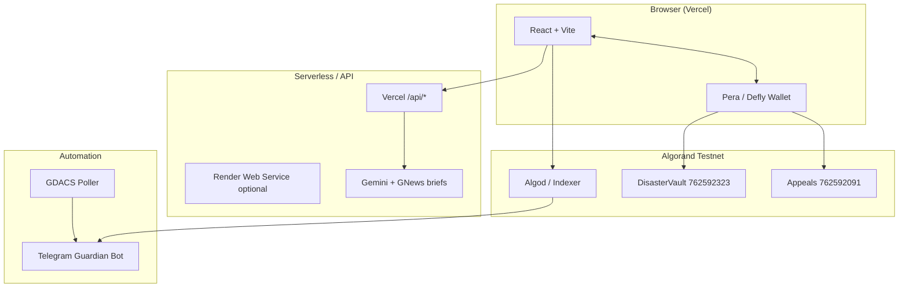

# AlgoVault

**Humanitarian disaster operations on Algorand** — live hazard signals, multi-signature approvals, and verifiable USDC disbursement in hours, not months.

[](https://testnet.algoexplorer.io/)
[](https://lora.algokit.io/testnet/application/762592323)
[](https://algorand.co/)

> **Live demo:** https://hackalgo.vercel.app/ · **Repo:** [github.com/AnirudhPratapSinghYadav/AlgoVault](https://github.com/AnirudhPratapSinghYadav/AlgoVault) · **Telegram:** [@AlgoVault_Guardian_bot](https://t.me/AlgoVault_Guardian_bot)

---

## Table of contents

1. [The story — why this exists](#the-story--why-this-exists)
2. [What AlgoVault does](#what-algovault-does)
3. [How it works](#how-it-works)
4. [Why three wallets & two signatures](#why-three-wallets--two-signatures)
5. [On-chain contracts (testnet)](#on-chain-contracts-testnet)
6. [Architecture](#architecture)
7. [Tech stack & why we chose it](#tech-stack--why-we-chose-it)
8. [Features & capabilities](#features--capabilities)
9. [Telegram Guardian automation](#telegram-guardian-automation)
10. [Community appeals flow](#community-appeals-flow)
11. [Setup guide](#setup-guide)
12. [Deployment (Vercel + Render)](#deployment-vercel--render)
13. [5-minute judge demo](#5-minute-judge-demo)
14. [Project structure](#project-structure)
15. [Verification & scripts](#verification--scripts)
16. [Documentation index](#documentation-index)

---

## The story — why this exists

When floods hit Bihar or cyclones strike the coast, families are on rooftops **today**. Institutional loss-and-damage frameworks often measure response in **years** — $395B in annual climate loss, but field cash arrives after convoys, paperwork, and multi-layer approval chains.

**AlgoVault** is built for the gap between:

- **Detection** — satellite and GDACS-class alerts the world can already see, and  
- **Delivery** — USDC/ALGO reaching verified beneficiaries with **proof** donors and auditors can click.

We do not replace NGOs, district collectors, or UN agencies. We give them an **operations console** where every release is signed, threshold-gated, and **explorable on Lora** in seconds.

---

## What AlgoVault does

| Layer | What happens |
|-------|----------------|
| **Signal** | Live GDACS disaster feed → map, severity badges, AI situation brief |
| **Campaign** | Operations admin creates an on-chain **USDC** relief campaign tied to an event |
| **Governance** | **Two independent approver wallets** must sign before funds unlock |
| **Release** | CSV beneficiaries → batch USDC disburse → **proof tab** with Lora links + PDF report |
| **Community** | Public can submit **ALGO appeals** → admin approves → donate → beneficiary withdraws |
| **Alerts** | Telegram bot pushes GDACS + on-chain activity; operators use `/status`, `/campaigns` |

**Network:** Algorand **Testnet** (mainnet-ready architecture; contracts not redeployed for finale demo).

---

## How it works

### End-to-end institutional flow



### Sequence — from alert to beneficiary



### Community appeals flow



---

## Why three wallets & two signatures

Humanitarian finance requires **separation of duties** — one person should not both **create** a campaign and **release** funds.

| Wallet | Role | Can do |
|--------|------|--------|
| **Operations admin** | `VITE_ADMIN_ADDRESS` | Create campaigns, execute disburse after approval |
| **Approver 1** | `VITE_DISASTER_APPROVER_1` | One `approve` signature per campaign |
| **Approver 2** | `VITE_DISASTER_APPROVER_2` | Second `approve` — unlocks disburse |

**Why 2-of-2 (not 1)?**  
The contract stores an approver list and `threshold` per campaign (set at `create_campaign`). Two distinct signatures prove **dual control** — standard NGO policy for relief releases.

**Why three accounts on one phone?**  
Demo uses **Pera Wallet** with multiple imported accounts — no second device. Switch account → refresh → sign. See [docs/DEMO_WALLETS.md](docs/DEMO_WALLETS.md).

> Approvers are **immutable per campaign** (stored in box storage). If you change `.env` approver addresses, **create a new campaign**.

---

## On-chain contracts (testnet)

| Contract | App ID | Asset | Lora application |
|----------|--------|-------|------------------|
| **DisasterVault** | `762592323` | USDC (`31566704`) | [Open in Lora →](https://lora.algokit.io/testnet/application/762592323) |
| **CommunityDonationHub** | `762592091` | ALGO | [Open in Lora →](https://lora.algokit.io/testnet/application/762592091) |

**Application addresses** (derived from app ID):

```text
DisasterVault:  https://lora.algokit.io/testnet/account/<getApplicationAddress(762592323)>
Appeals hub:    https://lora.algokit.io/testnet/account/<getApplicationAddress(762592091)>
```

**Status:** Testnet only — do **not** redeploy for the hack finale; approvers are baked into each campaign box.

### DisasterVault — ABI methods

| Method | Who calls | Purpose |
|--------|-----------|---------|
| `bootstrap` | Deployer (once) | Set admin + treasury |
| `create_campaign` | Admin | New USDC campaign + approver list |
| `donate` | Anyone | USDC into campaign (grouped axfer) |
| `approve` | Listed approver | Increment approval count |
| `disburse` | Admin | USDC to beneficiary wallets after threshold |
| `expire` | Anyone (after expiry) | Refund logic per contract rules |

Source: `savings_vault/projects/disaster_vault/smart_contracts/disaster_vault/contract.py`

### CommunityDonationHub — ABI methods

| Method | Who calls | Purpose |
|--------|-----------|---------|
| `create_appeal` | Submitter | New appeal (pending) |
| `admin_approve` | Admin | Enable donations |
| `donate` | Donor | ALGO to app |
| `withdraw` | Beneficiary | ALGO out to registered wallet |

Source: `savings_vault/projects/community_donation_hub/smart_contracts/community_donation_hub/contract.py`

### Example explorer links (fill after your demo)

Replace `<TXID>` with real IDs from **Release & Proof → Verify on blockchain**:

```text
Create campaign:  https://lora.algokit.io/testnet/transaction/<TXID>
Approval 1:       https://lora.algokit.io/testnet/transaction/<TXID>
Approval 2:       https://lora.algokit.io/testnet/transaction/<TXID>
Disburse:         https://lora.algokit.io/testnet/transaction/<TXID>
```

---

## Architecture



| Component | Path / command | Role |
|-----------|----------------|------|
| Frontend | `src/` | Ops console, landing, community pages |
| Wallet | `@txnlab/use-wallet-react` | Sign txs in Pera |
| Chain client | `src/integrations/disasterVaultChain.ts` | ARC-56 client, ATC disburse |
| Appeals | `src/services/communityDonation.ts` | create / approve / donate / withdraw |
| Event brief | `api/event-brief.ts`, `server/eventBriefHandler.ts` | Gemini + headlines |
| GDACS | `api/disaster-intel.ts` | Live event list |
| Bot | `scripts/bot/bot.ts` | Telegram commands + alerts |
| Alerts | `scripts/bot/alertService.ts` | Poll GDACS + chain |

Deep dive: [docs/PRODUCT_STATUS.md](docs/PRODUCT_STATUS.md) · [docs/INTEGRATIONS.md](docs/INTEGRATIONS.md)

---

## Tech stack & why we chose it

| Technology | Why |
|------------|-----|
| **Algorand + PuyaPy** | Fast finality, low fees, USDC ASA, box storage per campaign |
| **AlgoKit / ARC-4** | Typed contracts, generated clients, Lora verification |
| **React 18 + Vite + TS** | Fast ops UI, type-safe contract calls |
| **Zustand** | Persisted ops state, chain hydration |
| **Pera Wallet** | India-first mobile signing; multi-account on one phone |
| **GDACS** | Authoritative global disaster feed (free, public) |
| **Gemini + GNews** | Situation briefs for operators (server-side keys only) |
| **Telegram Bot API** | Field-friendly alerts where NGOs already work |
| **Vercel** | HTTPS frontend + serverless `/api` |
| **Render** | Optional long-running Telegram worker |
| **jsPDF** | Downloadable campaign proof for donors |

### Landscape (not a feature matrix)

Traditional humanitarian stacks (SPHERE, UN OCHA tools, bank files) optimize for **compliance**, not **settlement speed**. On-chain pilots (various L1s) often stop at **donation** without **governed disbursement**. AlgoVault focuses on **ops-grade dual approval + USDC release + public proof** on Algorand — not a generic donation page.

---

## Features & capabilities

### Operations console (`/operations`)

- **Overview** — pipeline snapshot, live metrics  
- **Active Events** — GDACS sync, severity, create campaign, AI brief drawer  
- **Approvals** — multi-sig progress, Lora verify per approval  
- **Appeals** — community queue, admin approve, fund from ops  
- **Release & Proof** — CSV import, USDC disburse, proof rows, **PDF report**  
- **Incident Map** — geo pins, focus deep links  
- **Settings** — wallet addresses, Lora contract links, alert channels  

### Public

- **Landing** — narrative story, $0 / $395B framing, Enter Operations  
- **Access** — Pera connect (QR from laptop)  
- **Community feed** — `/community/feed`, submit crisis, donate, withdraw  

### Strict demo mode

`VITE_DEMO_STRICT=true` — no fake tx hashes or seed metrics in ops UI.

---

## Telegram Guardian automation

**Bot:** [@AlgoVault_Guardian_bot](https://t.me/AlgoVault_Guardian_bot)

Run locally or on Render worker: `npm run services`

| Command | Action |
|---------|--------|
| `/status` | Bot + network health |
| `/campaigns` | On-chain campaign list |
| `/subscribe flood` | GDACS alert subscriptions |
| `/approve` | Approver deeplink flow |

**Alert service** (`alertService.ts`): polls GDACS ~15 min and chain ~2 min → pushes to `TELEGRAM_CHAT_ID`.

---

## Community appeals flow

1. **`/submit-crisis`** — user connects Pera → `create_appeal`  
2. **`/operations/community-queue`** — admin `admin_approve`  
3. **`/appeal/:id/donate`** — donor `donate` ALGO  
4. **`/appeal/:id/withdraw`** — beneficiary `withdraw`  

Contract: [762592091 on Lora](https://lora.algokit.io/testnet/application/762592091)

---

## Setup guide

### Prerequisites

- Node.js **20+**
- [Pera Wallet](https://perawallet.app/) (mobile + desktop QR)
- Testnet ALGO + USDC ([dispenser](https://bank.testnet.algorand.network))

### 1. Clone & install

```bash
git clone https://github.com/AnirudhPratapSinghYadav/AlgoVault.git
cd AlgoVault
npm install
```

### 2. Environment

```bash
cp .env.example .env
```

**Required for on-chain demo:**

```env
VITE_NETWORK=testnet
VITE_DISASTER_APP_ID=762592323
VITE_APPEALS_APP_ID=762592091
VITE_STABLECOIN_ASSET_ID=31566704
VITE_USE_REAL_CONTRACT=true
VITE_ADMIN_ADDRESS=<your admin>
VITE_DISASTER_APPROVER_1=<approver 1>
VITE_DISASTER_APPROVER_2=<approver 2>
```

**Server / bot (no `VITE_` prefix):**

```env
GEMINI_API_KEY=
GNEWS_API_KEY=
TELEGRAM_BOT_TOKEN=
TELEGRAM_CHAT_ID=
```

Generate wallets: `npm run wallets:generate` — see [docs/DEMO_WALLETS.md](docs/DEMO_WALLETS.md).

### 3. Fund contracts & opt-in

```bash
npm run fund:humanitarian
npm run optin:usdc
```

### 4. Run locally

```bash
# Terminal 1 — web
npm run dev -- --host

# Terminal 2 — API (optional if using Vercel serverless locally)
npm run start:server

# Terminal 3 — Telegram
npm run services
```

Open **http://localhost:5173**

---

## Deployment (Vercel + Render)

| Service | Platform | Command |
|---------|----------|---------|
| Frontend + `/api` | **Vercel** | `npm run build` |
| API (optional) | **Render Web** | `npm run start:server` |
| Telegram | **Render Worker** | `npm run services` |

Full guide: **[docs/DEPLOY.md](docs/DEPLOY.md)**

**Render start command (common mistake):** use `npm run start:server` — **not** `start:service` unless on latest `main` (alias added).

---

## 5-minute judge demo

### One phone + one laptop

1. Open **Vercel URL** → **Enter Operations**  
2. **Access** → **Continue with Pera** → scan QR → **Admin** account  
3. **Active Events** → pick red/orange event → **Create Campaign** → sign  
4. **Approvals** → switch Pera to **Approver 1** → Approve → switch to **Approver 2** → Approve  
5. **Release & Proof** → Admin account → CSV:

   ```csv
   Ravi Kumar,WALLET_ADDRESS_1,5
   Priya Sharma,WALLET_ADDRESS_2,5
   ```

   → **Disburse** → **Payment proof** → **Verify on blockchain** → **Download Report**  
6. (Optional) Telegram `/status`, `/campaigns`

### If something breaks

| Problem | Fix |
|---------|-----|
| Create disabled | Connect admin wallet |
| Approve missing | Wrong Pera account |
| Disburse fails | `npm run fund:humanitarian` |
| Telegram 409 | Only one `npm run services` instance |

---

## Project structure

```text
AlgoVault/
├── src/                    # React app (pages, ops, stores, services)
├── api/                    # Vercel serverless routes
├── server/                 # Express API (Render / local)
├── scripts/bot/            # Telegram Guardian + alert poller
├── savings_vault/projects/
│   ├── disaster_vault/     # PuyaPy DisasterVault contract
│   └── community_donation_hub/
├── docs/                   # DEMO_WALLETS, DEPLOY, PRODUCT_STATUS, SUBMISSION_GTM
├── vercel.json
└── render.yaml
```

---

## Verification & scripts

```bash
npm run build          # production build
npx tsc --noEmit       # typecheck
npm run verify:lora    # export Lora verification bundle
npm run verify:deployment
```

---

## Documentation index

| Doc | Contents |
|-----|----------|
| [docs/SUBMISSION_GTM.md](docs/SUBMISSION_GTM.md) | **Google Form** copy-paste + GTM 1-pager |
| [docs/DEPLOY.md](docs/DEPLOY.md) | Vercel + Render |
| [docs/DEMO_WALLETS.md](docs/DEMO_WALLETS.md) | Approver addresses |
| [docs/PRODUCT_STATUS.md](docs/PRODUCT_STATUS.md) | Full technical audit |
| [docs/INTEGRATIONS.md](docs/INTEGRATIONS.md) | AlgoBharat ecosystem map |
| [AGENTS.md](AGENTS.md) | Algorand agent workflow |

---

## License & hackathon

Built for **AlgoBharat Hack Series 3.0 — Round 3** (AlgoHack India 2026).

**Team:** AlgoVault — humanitarian ops on Algorand.

---

<p align="center">
  <strong>Every payout verifiable.</strong><br/>
  <a href="https://lora.algokit.io/testnet/application/762592323">DisasterVault on Lora</a> ·
  <a href="https://lora.algokit.io/testnet/application/762592091">Appeals on Lora</a>
</p>
